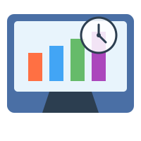

# Screen Time Tracker

A Windows application for monitoring and analyzing your computer usage and screen time.

## Features

- **Real-time Activity Tracking**: Monitors active applications and tracks usage time
- **Idle Detection**: Automatically pauses tracking when your system is idle
- **Usage Statistics**: View daily and weekly breakdowns of application usage
- **Data Visualization**: Charts and graphs to visualize your computer usage
- **System Tray Integration**: Runs quietly in the system tray without interrupting your workflow
- **Customizable Settings**: Configure idle thresholds and other tracking preferences

## Requirements

- Windows OS
- .NET 9.0 Runtime

## Usage

After launching the application, it will begin running in the system tray. Right-click on the tray icon to:

- View usage statistics
- Access settings
- Exit the application

### Settings

Access settings to configure:

- Idle detection threshold (default: 2 minutes)
- Break reminder (default: 45 minutes)

## Technology Stack

- C# / .NET 9.0
- Windows Forms for UI
- Entity Framework Core with SQLite for data storage
- Windows API for application monitoring

## Project Structure

- **Core/**: Core application logic and monitoring functionality
- **Data/**: Database models and data access layer using Entity Framework Core
- **Interop/**: Windows API interop for monitoring active applications
- **UI/**: User interface forms for statistics and settings
- **Utils/**: Helper classes and utility functions

## Future Work

1. App Categorization
    - Allow users to categorize applications (Productivity, Entertainment, Social Media, etc.)
    -  Show category-based charts and statistics
    - Calculate productivity metrics based on app categories

2. Focus Mode
    - Create a feature to block distracting apps for set time periods
    - Show statistics on successful focus sessions

3. Enhanced Data Visualization
    - Add pie charts showing app usage by category
    - Implement heat maps showing usage patterns by hour of day
    - Create monthly and yearly summary views

